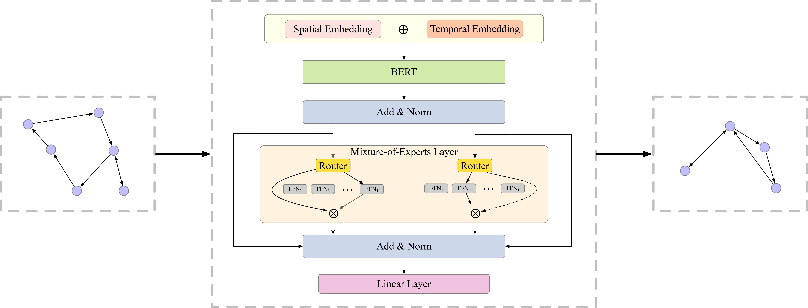

# ST-MoE-BERT: A Spatial-Temporal Mixture-of-Experts Framework for Long-Term Cross-City Mobility Prediction

✨ If you find this resource helpful, please consider citing our paper:

```bibtex
@inproceedings{he2024stmoebert,
  title={{ST-MoE-BERT}: A Spatial-Temporal Mixture-of-Experts Framework for Long-Term Cross-City Mobility Prediction},
  author={Haoyu He, Haozheng Luo, Qi R. Wang},
  booktitle={Proceedings of the 2rd International Workshop on the Human Mobility Prediction Challenge},
  year={2024}
}
```

## Introduction

This repository contains the code for the paper "ST-MoE-BERT: A Spatial-Temporal Mixture-of-Experts Framework for Long-Term Cross-City Mobility Prediction". The code is based on the [ST-MoE-BERT]()




## Data

The datasets used in this project are sourced from [Yabe et al.](https://www.nature.com/articles/s41597-024-03237-9), consisting of human mobility data from four major cities in Japan. The distribution of users across each city is as follows:

- **City A:** 100,000 users
- **City B:** 25,000 users
- **City C:** 20,000 users
- **City D:** 6,000 users

### Pretraining and Fine-tuning Strategy

In this project, **City A**'s data (the largest dataset with 100,000 users) is used for pretraining the model. The data from **Cities B, C,** and **D** are subsequently used for fine-tuning, allowing the model to adapt to varying spatial characteristics across different urban environments.

### Data Structure

The data consists of individual mobility trajectories recorded over time, with movements mapped to a 500-meter by 500-meter grid format. This structure allows for precise spatial-temporal analysis.


## Requirements

Ensure you have Python 3.8+ installed on your system. The dependencies for this project can be installed via:

```bash
pip install -r requirements.txt
```

## Usage

### Training and Fine-tuning the Model

To initiate training or fine-tuning of a model, use the `run.sh` script. This script is designed to be flexible, allowing you to specify the model architecture, training parameters, and the city for which you want to train or fine-tune the model. Initially, you can train on one city (e.g., City A) and then fine-tune the trained model on other cities (e.g., Cities B, C, and D). Here's how to use the script:

```bash
./run.sh
```

### Command Line Arguments

These are the configurable options available when executing the training and fine-tuning script. Adjust these arguments according to your requirements and dataset specifics:

- `--model_name`: Specifies the model architecture to train, either `MobilityBERT` or `MobilityBERTMoE`.
- `--num_location_ids`: Defines the number of unique location IDs available in the dataset.
- `--hidden_size`: Sets the size of hidden layers within the model.
- `--hidden_layers`: Indicates the number of hidden layers to include in the model architecture.
- `--attention_heads`: Determines the number of attention heads in each attention layer.
- `--day_embedding_size`: Size of the embedding vector for day-related features.
- `--time_embedding_size`: Size of the embedding vector for time-related features.
- `--day_of_week_embedding_size`: Size of the embedding vector for day-of-week features.
- `--weekday_embedding_size`: Size of the embedding vector for distinguishing weekdays.
- `--location_embedding_size`: Specifies the size of the embedding vector for location IDs.
- `--dropout`: The dropout rate to apply within the model for regularization.
- `--max_seq_length`: The maximum sequence length that the model expects as input.
- `--lr`: The base learning rate for the optimizer.
- `--location_embedding_lr`: Optional, specifies a different learning rate for the location embeddings if needed; if not set, the `base_lr` is used for all parameters.
- `--num_epochs`: The total number of training epochs.
- `--device`: The computing device to use, such as `cuda:0` for GPU or `cpu` for CPU.
- `--model_path`: The file path to the pre-trained model weights, used for initializing the model before training.
- `--city`: The city for which to train the model (A, B, C, and D).
- `--batch_size`: The batch size to use during training.
- `--input_seq_length`: The length of the input sequence for the model.
- `--predict_seq_length`: The length of the output sequence for the model.
- `--look_back_len`: The number of days to look back for training data.

## Model Configuration

Ensure you update the `run.sh` script or the model training command according to your specific setup and data.
